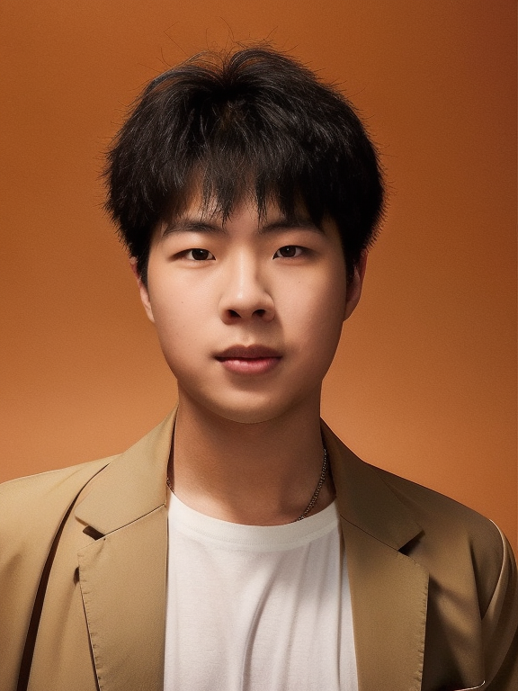

<!-- 
 -->
<!-- 
 -->
<!-- 
-->

# About Me

Here is **Songning Lai (赖颂宁)**.( You can call me Sony. )

I am a junior student studying in the School of Information Science and Engineering([**Chongxin College**](https://baike.baidu.com/item/%E5%B1%B1%E4%B8%9C%E5%A4%A7%E5%AD%A6%E5%B4%87%E6%96%B0%E5%AD%A6%E5%A0%82/20809738?fr=aladdin)), [**Shandong University**](https://www.sdu.edu.cn/) in China,supervised by Prof. [**Zhi Liu**](https://faculty.sdu.edu.cn/liuzhi1/zh_CN/index.htm).

## Research Interests

My research interests are Explainable AI (XAI) and Privacy-preserving AI. Specifically, my research goal is to build faithful XAI systems which are easily understood by users and are robust in various environments (e.g. XAI4LLM, XAI4NLP, XAI4MM, XAI4CV, XAI4Security and so on). I am also interested in applying the XAI to real-world scenarios (e.g. optical systems, recommender systems, and traffic forecasting etc.).

Prior to this, I have also been exposed to bioinformatics, multimodal sentiment analysis, domain generalization and other research areas.

**Please feel free to email me to discuss potential research collaborations.(sonly@mail.sdu.edu.cn)**

## News and Update

- **Mar 2024 :**  I am awarded the honor of **excellent graduate of Shandong Province** and **excellent graduate of Shandong University**.
- **Mar 2024 :** Our paper on MSA was accepted by [**IJCNN2024**](https://www.google.com/search?q=ijcnn2024&oq=IJCNN&gs_lcrp=EgZjaHJvbWUqBggCECMYJzIGCAAQRRg9MgYIARBFGDsyBggCECMYJzIGCAMQABgeMgYIBBBFGDsyBggFEAAYHjIGCAYQRRg9MgYIBxBFGDzSAQg0MzIyajBqN6gCALACAA&sourceid=chrome&ie=UTF-8)(CCF C).
- **Jan 2024 :** Our paper on [faithful label free CBM](https://openreview.net/forum?id=rp0EdI8X4e) was accepted by [**ICLR 2024**](https://openreview.net/group?id=ICLR.cc/2024/Conference)(CCF None).
- **Oct 2023 :** A work was accepted by the journal [**Displays**](https://www.sciencedirect.com/journal/displays) (JCR Q1).
- **Oct 2023 :** A work was accepted by the journal [**Image and Vison Computing**](https://www.sciencedirect.com/journal/image-and-vision-computing) (JCR Q1; CCF C).
- **Nov 2022 :** Happy to get the **First Prize** in Contemporary Undergraduate Mathematical Contest in Modeling National (top 0.6%).
- **Nov 2022 :** I am very glad to give an **oral** report at the international conference [CISP-BMEI](http://www.cisp-bmei.cn/) 2022 and win the **Best Paper Award**.

 <a href="https://www.easycounter.com/">Hit Counters  since Oct 2023</a>

